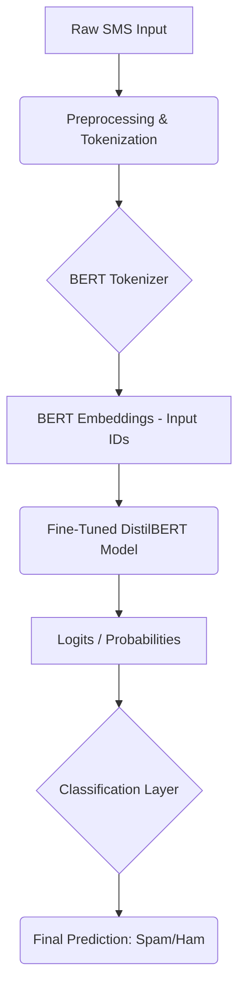
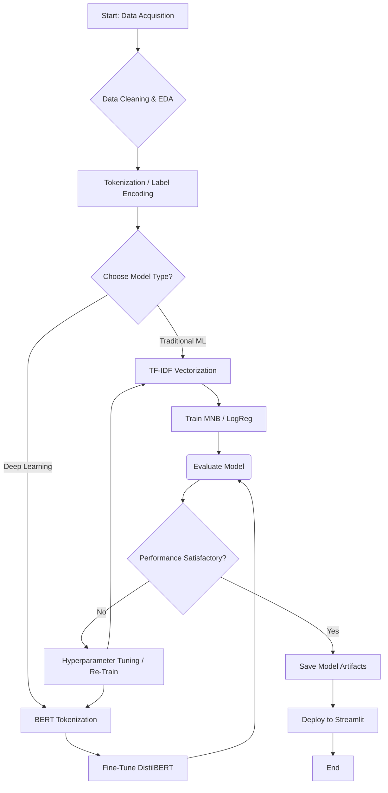

# SMS Spam Detection System: A Hybrid ML/DL Approach 📧📖

## Overview
This project implements an end-to-end **SMS Spam Detection system** that classifies incoming messages as either **Spam** or **Ham (Legitimate)**. The system was developed using two distinct approaches: a traditional **Machine Learning (ML)** baseline and a state-of-the-art **Deep Learning (DL)** enhancement using a **Transformer model**. The final application is deployed via **Streamlit** for an interactive user interface.

---

## ✨ Key Features
- **Dual Model Architecture:** Implements a baseline **Multinomial Naive Bayes (MNB)** model and an advanced **DistilBERT** model for comparative analysis.  
- **High Performance:** The BERT-enhanced model achieves an **F1-Score exceeding 0.96** on the minority (spam) class, demonstrating superior recall and overall detection capability.  
- **Full Pipeline Implementation:** Includes data loading, preprocessing, feature engineering (**TF-IDF vs. Tokenization**), model training, evaluation, and serialization.  
- **Web Deployment:** An interactive web application built with **Streamlit** for real-time classification.  

---

## 🚀 Installation and Setup

### Clone the Repository
```bash
git clone [Your_Repository_URL]
cd sms_spam_detector
```

### Create and Activate Environment
```bash
python -m venv spam_detector_env
# For Windows:
.\spam_detector_env\Scriptsctivate
# For macOS/Linux:
source spam_detector_env/bin/activate
```

### Install Dependencies
```bash
pip install -r requirements.txt
```

### Download NLTK Data
```python
import nltk
nltk.download('stopwords')
nltk.download('wordnet')
```

### Acquire Data
Place the **SMSSpamCollection** file (from the **UCI repository**) into the project's root folder.

---

## ⚙️ Model Training and Artifact Generation

The project includes two training paths. Run the script for the model you wish to deploy:

### A. Baseline Model Training (MNB)
Run this script to generate the **spam_model.pkl** and **tfidf_vectorizer.pkl** files:
```bash
python preprocess_train.py
```

### B. Advanced Model Training (BERT/DistilBERT)
Run this script to generate the **bert_spam_detector_final** folder containing the transformer model and tokenizer:
```bash
python bert_train.py
```

---

## 🛠️ Usage and Deployment
To launch the web application using the **BERT-enhanced model**:
```bash
streamlit run app.py
```
> **Note:** If you wish to deploy the MNB model, update the `app.py` loading logic to reference the `.pkl` files and comment out the BERT loading logic.

---

## 🗂️ Project Architecture Flowchart
This diagram illustrates the flow of data through the production system (**Inference/Deployment Phase**):



---

## 🔄 Development Workflow Flowchart
This diagram illustrates the full development process, from data acquisition to the final deployment:



---

## ❤️ Acknowledgements
**Prepared by:** Vikram .P  
**Institution/Department:** SKP Engineering College / CSE (Cybersecurity)  
**Dataset:** UCI SMS Spam Collection  
**Technologies:** Python, scikit-learn, pandas, numpy, nltk, matplotlib, seaborn, Streamlit, and Hugging Face transformers (DistilBERT).  
